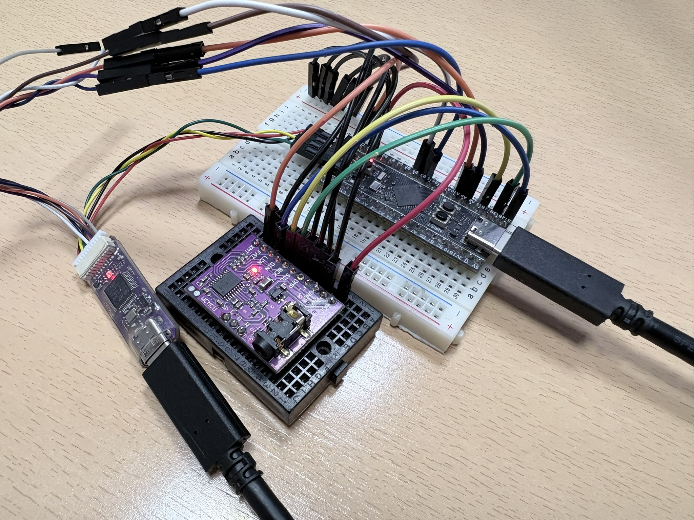

# stm32f411-synth

A real-time, bare-metal FM synthesizer running on an STM32F411 (BlackPill). Connect it to a PC via USB -- it appears as a USB MIDI device. Send notes from a DAW or route a MIDI keyboard with `aconnect`, and get 6-voice polyphonic FM synthesis output through a PCM5102A DAC at 48 kHz. The entire signal path runs in interrupt context with zero allocations. Uses [synth](https://github.com/jmaltar/synth) as a git submodule for the shared synthesis engine.

## Hardware

- **Board**: WeAct STM32F411CEU6 (BlackPill)
- **CPU**: ARM Cortex-M4 @ 96 MHz (HSE 25 MHz, PLL to 96 MHz)
- **Audio**: PCM5102A DAC via I2S2 (SPI2), 48 kHz stereo 16-bit, Philips standard
- **MIDI**: USB OTG FS (TinyUSB device, appears as USB MIDI)
- **Debug**: UART1 @ 115200 baud (e.g. via [WeAct MiniDebugger](https://github.com/WeActStudio/WeActStudio.MiniDebugger))

### I2S wiring (to PCM5102A)



| STM32 pin | Function | PCM5102A pin |
|-----------|----------|--------------|
| PB12 | I2S2_WS | LCK |
| PB13 | I2S2_CK | BCK |
| PB15 | I2S2_SD | DIN |

PCM5102A configuration pins:

| PCM5102A pin | Connect to |
|--------------|------------|
| FMT | GND |
| SCL | GND |
| DMP | GND |
| FLT | GND |
| GND | GND |
| VCC | 5V |
| XMT | 3.3V |

### USB

Connect the BlackPill's USB port to a computer. It enumerates as a USB MIDI device. Send notes from a DAW, or route a hardware MIDI keyboard through the PC with `aconnect`:

```bash
# list MIDI ports
aconnect -l

# route a MIDI keyboard (e.g. client 24) to the synth (e.g. client 28)
aconnect 24:0 28:0
```

### UART debug (optional)

| STM32 pin | Function |
|-----------|----------|
| PA9 | USART1 TX |
| PA10 | USART1 RX |


## How it works

On boot, the firmware initializes the system clock (96 MHz via PLL), peripherals (I2S, DMA, UART, USB), and the synth engine. The I2S peripheral starts a circular DMA transfer from a double-buffered audio buffer.

The DMA triggers two callbacks:
- **Half-complete** -- fills the first half of the buffer with fresh samples
- **Full-complete** -- fills the second half

Each callback calls `synth(buffer)`, which renders one block of audio (16 mono samples = 64 stereo int16 values) by summing all active FM voices.

In the main loop, `tud_task()` polls the USB stack and `midi_task()` reads incoming MIDI packets. Note on/off events are forwarded to the synth with interrupts briefly disabled to prevent races with the DMA callbacks.

## Toolchain

- `gcc-arm-none-eabi`
- CMake >= 3.22
- OpenOCD (for flashing via ST-Link)

Install on Ubuntu/Debian:

```bash
sudo apt install gcc-arm-none-eabi cmake openocd
```

## Build

Clone with submodules:

```bash
git clone --recurse-submodules https://github.com/jmaltar/stm32f411-synth.git
```

Build:

```bash
cmake --preset Debug -S .
cmake --build build/Debug -j$(nproc)
```

For release (with `-ffast-math` on synth sources):

```bash
cmake --preset Release -S .
cmake --build build/Release -j$(nproc)
```

VS Code tasks: **Build Debug**, **Build Release**.

Note: clangd is configured to use `build/Release/compile_commands.json`, so build Release at least once for IDE features (go-to-definition, diagnostics) to work. After building, run **clangd: Restart language server** from the VS Code command palette.

## Flash

Connect a [WeAct MiniDebugger](https://github.com/WeActStudio/WeActStudio.MiniDebugger) (or any ST-Link V2 compatible probe) to the SWD header, then:

```bash
openocd -f interface/stlink.cfg -f target/stm32f4x.cfg \
  -c 'program build/Debug/stm32f411-synth.elf verify reset exit'
```

VS Code tasks: **Flash Debug**, **Flash Release**, **Clean Debug**, **Clean All (wipe build/)**.

## Configuration

- `SYNTH_N_VOICES=6` -- 6 voices of FM synthesis (set in CMakeLists.txt)
- I2S DMA buffer: 64 stereo samples, double-buffered
- DMA interrupt priority: 13 (low, preemptible by USB and UART)
